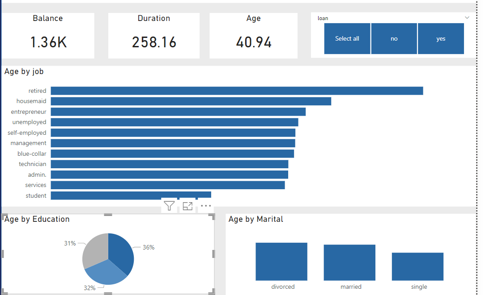

### Data Visualizaion

#### Introduction:
Presenting complex information and data in a visual form, such as graphs, charts, maps, and infographics, is known as data visualization. This method goes beyond tabular data, transforming it into a dynamic, graphical representation that is easier for people to access and understand.

Data visualization is a crucial tool for decision-makers, analysts, and researchers. in a world-embracing data, data visualization enables users to transform huge data sets into understandable and useful knowledge. One of the tasks given is to create a tracking dashboard revealing its insights and their importance.

#### Problem Statement:
Create a tracking dashboard for a bank using the “Bank term deposit subscription’ dataset provided.

The screenshot above displays an Age Tracking Dashboard, which visualizes the average ages of individuals based on their employment status, education levels, and marital status, with the added feature of a loan slicer for filtering. 

### Conclusion:

the Age Tracking Dashboard is a valuable tool for understanding how age relates with employment, education, and marital status.

From the visualization, it is shown that People with primary education tend to be older than those with secondary and tertiary education. Additionally, it emphasizes that married and divorced people are often older on average than single people. 

The addition of a loan slicer further improves the dashboard's functionality by enabling users to analyze the data and get an understanding of the relationship between the average age of employed people and loan status.

This dashboard serves as a useful tool for making informed decisions and deriving meaningful insights from age-related data.

The visualization indicates that, on average, those with primary education tend to be older compared to those with secondary and tertiary education.

Furthermore, The insight highlights that married and divorced individuals have a higher average age than those who are single. Additionally, the dashboard enables users to view the average age of employed individuals while using a slicer to separate those with loans from those without.
